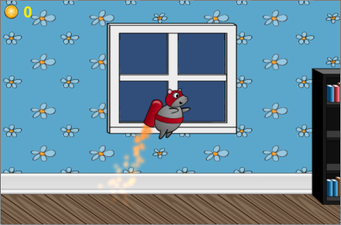

# Jetpack Ramble



Jetpack Ramble is a very simple, single-level game in the style of Jetpack Joyride.
Its purpose is to serve as a demo game that illustrates some of the basics of using the Intoli Unity Plugin in a game made with Unity.
If you're not familiar with Intoli then you can read more about it at [intoli.com](http://intoli.com).
The short version is that it's a new type of analytics service that handles personalization and gameplay optimization in a fully automated way.

## Getting Started

These instructions will help you get to the point where the game is integrated with your account on [intoli.com](http://intoli.com) and fully operational.
From there, you can explore our [API documentation](https://intoli.com/docs/api/) and try to make your own modifications using the Intoli SDK.

### Account and Game Setup

In order to use the Intoli Unity Plugin, you'll first have to [create a free Intoli account](http://intoli.com/user/register).
You'll then need to create a new game on the Intoli website in order to associate it with the Unity project for Jetpack Ramble.
This can be done by visiting [intoli.com](http://intoli.com/games) and clicking `Create New Game`.
Then enter "Jetpack Ramble" as the name of the game and click `Create` to actually create the game.
You may need to validate your email address before being able to add a new game.

If you haven't done so yet, you should now open the Jetpack Ramble project from within Unity.
You will then be able to select `Window > Intoli > Settings` from the menu bar and login using your Intoli account credentials.
Note that the Intoli submenu will only be present in games that use the Intoli Unity Plugin.
It's included in the Jetpack Ramble game already but you'll need to download the [Intoli.unitypackage](http://intoli.com/static/plugins/latest/Intoli.unitypackage) file and import it into any of your own games.
More details can be found in the [installation documentation](http://intoli.com/docs/installation).

After logging in, you will be able to see the plugin controls in the inspector region.
Select "Jetpack Ramble" from the `Games` dropdown to associate the project with the game in your account.

### Adjustable Variables

After selecting the game in the dropdown menu you should see a listing of gameplay related variables under the heading `adjustable variables`.
These are the variables that the Intoli SDK will use to personalize gameplay and maximize your desired metrics.
These variables are registered in the source code of the game and the plugin has identified them through reflection.
Two of these variable registrations relate to the player physics and are found in MouseController.cs:

```csharp
Intoli.Register(this, "jetpackSpeed").As(
    new AdjustableVariable("Physics:Player:Jetpack Speed")
);
Intoli.Register(this, "forwardMovementSpeed").As(
	new AdjustableVariable("Physics:Player:Movement Speed")
		.Affecting(GameConcepts.difficulty, 0.8)
);
```
and the other two relate to the obstacle physics and are found in LaserController.cs:

```csharp
Intoli.Register (this, "interval").As (
	new AdjustableVariable ("Physics:Laser:Interval")
);
Intoli.Register (this, "rotationSpeed").As (
	new AdjustableVariable ("Physics:Laser:Rotation Speed")
);

```

More details about variable registration can be found in the documentation for [Adjustable Variables](http://intoli.com/docs/api/AdjustableVariable.html).

Each adjustable variable that's listed should also include a warning about the variable not being validated on intoli.com and a `Validate` button.
The `Validate` button for each of these variables will open a link in your browser allowing you to add the corresponding variable (the values should be prefilled automatically).
After validating each adjustable variable, you'll need to give them ranges and values.
Copying the values in the table below is a reasonable starting point.

| Adjustable Variable           | Minimum | Maximum | Value |
| ----------------------------- | ------- | ------- | ----- |
| Physics:Laser:Interval        | 0.0     | 1.0     | 0.5   |
| Physics:Laser:Rotation Speed  | 10.0    | 100.0   | 50.0  |
| Physics:Player:Jetpack Speed  | 15.0    | 75.0    | 30.0  |
| Physics:Player:Movement Speed | 1.0     | 10.0    | 5.0   |

After setting up your adjustable variables, go back into Unity and select the `Testing Mode` option in the Intoli settings window.
You can then either press play in the Unity Editor or build and run on the platform of your choice while testing mode is selected.
The values that you select on the adjustable variables page will be applied in real-time when the game is run in testing mode.
Try moving around the sliders on the adjustable variables page while playing the game in testing mode and see how the feel of the game is affected.

The purpose of testing mode is to figure out variable ranges that would be reasonable in production but also allow for meaningful variability in the game.
More information about this can be found in the documentation for [testing mode](http://intoli.com/docs/api/Intoli.Settings.testingMode.html).
The ranges in the table above are a bit too extreme to be reasonable in production, see if you can come up with better minimum and maximum values.

### Deploying and Optimization

Once you've set reasonable ranges for all of your adjustable variables then you can click on the `Deploy` button to apply these ranges to production builds.
To make a production build, you simply need to make sure that both the `Testing Mode` and `Disable` options are unselected before building.
A production build will automatically work to find the values of your adjustable variables that will maximize any metric you select in your [game's settings](http://intoli.com/game/settngs).
